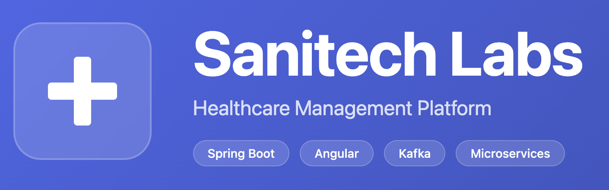

Piattaforma di gestione sanitaria costruita con architettura a microservizi.

## Indice

- [Panoramica](#panoramica)
- [Architettura](#architettura)
- [Prerequisiti](#prerequisiti)
- [Avvio rapido](#avvio-rapido)
- [Accesso alla piattaforma](#accesso-alla-piattaforma)
- [Struttura del progetto](#struttura-del-progetto)
- [Servizi backend](#servizi-backend)
- [Servizi infrastrutturali](#servizi-infrastrutturali)
- [Applicazione frontend](#applicazione-frontend)
- [Configurazione](#configurazione)
- [Sviluppo](#sviluppo)
- [Documentazione](#documentazione)

## Panoramica

Sanitech Labs è una piattaforma sanitaria completa che offre:

- **Gestione pazienti**: Registrazione, cartelle cliniche e gestione consensi
- **Directory medici**: Gestione personale con assegnazione a reparti
- **Prenotazione appuntamenti**: Gestione slot e sistema di prenotazione
- **Telemedicina**: Videoconsulti tramite integrazione LiveKit
- **Documenti clinici**: Archiviazione sicura documenti con S3/MinIO
- **Gestione pagamenti**: Fatturazione e tracciamento pagamenti
- **Audit trail**: Logging completo delle attività per compliance

## Architettura

```
                            Frontend (Angular SPA)
                             http://localhost:4200
                                      |
                                      v
                            API Gateway (svc-gateway)
                             http://localhost:8080
                   Validazione JWT - Routing - Aggregazione OpenAPI
                                      |
     +--------+--------+--------+-----+-----+--------+--------+--------+
     |        |        |        |           |        |        |        |
     v        v        v        v           v        v        v        v
Directory Schedul. Admiss. Consents      Docs   Notif.  Audit  Payments
  :8082    :8083    :8084    :8085       :8086   :8087   :8088   :8090
     |        |        |        |           |        |        |        |
     +--------+--------+--------+-----------+--------+--------+--------+
                                      |
              +-----------------------+-----------------------+
              |                       |                       |
              v                       v                       v
           Kafka                  Keycloak                  MinIO
          (eventi)                 (OIDC)                    (S3)
```

## Prerequisiti

| Strumento | Versione | Note |
|-----------|----------|------|
| Docker | 24+ | Docker Compose V2 incluso |
| Java | 21 | Per sviluppo backend |
| Node.js | 18+ | Per sviluppo frontend |
| Maven | 3.9+ | Build tool (wrapper incluso) |

## Avvio rapido

### Stack completo (Backend + Infrastruttura + Frontend)

```bash
# Avvia l'intero stack (backend, infrastruttura e frontend)
bash .script/backend/up.sh

# Visualizza i log
bash .script/backend/logs.sh

# Controlla lo stato
bash .script/backend/status.sh

# Ferma lo stack
bash .script/backend/down.sh

# Ferma e rimuovi i volumi (stato pulito)
REMOVE_VOLUMES=true bash .script/backend/down.sh
```

### Solo Frontend (Modalità sviluppo)

```bash
# Server di sviluppo con hot reload (richiede backend attivo)
cd sanitech-fe
npm install
npm start
# Accessibile su http://localhost:4200
```

### Comandi Make

```bash
# Dalla root del repository
make -C sanitech-svc compose-up       # Avvia con build
make -C sanitech-svc compose-down     # Ferma lo stack
make -C sanitech-svc compose-config   # Valida la configurazione

# Selezione ambiente
ENV=staging make -C sanitech-svc compose-up-infra
ENV=prod make -C sanitech-svc compose-up-infra
```

## Accesso alla piattaforma

### URL componenti

| Componente | URL | Note |
|------------|-----|------|
| **Frontend (Angular SPA)** | http://localhost:4200 | Interfaccia utente |
| **API Gateway** | http://localhost:8080 | Entry point API REST |
| **Swagger UI** | http://localhost:8080/swagger-ui/index.html | Documentazione API interattiva |
| **Keycloak (Admin Console)** | http://localhost:8081 | Identity provider |
| **Grafana** | http://localhost:3000 | Dashboard e monitoraggio |
| **Prometheus** | http://localhost:9090 | Metriche |
| **MinIO Console** | http://localhost:9001 | Object storage (documenti) |
| **Mailpit** | http://localhost:8025 | Casella email di test |

### Utenze di test

Tutte le utenze usano la password: `qwerty`

| Profilo | Username | Email | Password |
|---------|----------|-------|----------|
| **Amministratore** | `admin` | admin@sanitech.example | `qwerty` |
| **Medico** | `mario.rossi.dr` | mario.rossi.dr@sanitech.example | `qwerty` |
| **Paziente** | `anna.conti` | anna.conti@email.example | `qwerty` |

> Le utenze sono preconfigurate nel realm Keycloak (`.infra/keycloak/realm-export/sanitech-realm.json`). Per l'elenco completo di medici e pazienti disponibili, consultare il file di seed dati `sanitech-svc/svc-directory/src/main/resources/db/migration/V11__seed_demo_data.sql`.

## Struttura del progetto

```
sanitech-labs/
├── .infra/                    # Configurazione infrastruttura
│   ├── docker-compose.yml     # File compose principale (backend + infra + frontend)
│   ├── env/                   # File di ambiente
│   │   ├── env.local          # Sviluppo locale
│   │   ├── env.staging        # Ambiente staging
│   │   └── env.prod           # Ambiente produzione
│   ├── grafana/               # Dashboard e provisioning Grafana
│   ├── keycloak/              # Configurazione ed export realm Keycloak
│   ├── livekit/               # Configurazione server LiveKit
│   └── prometheus/            # Configurazione scrape Prometheus
├── .script/                   # Script operativi
│   ├── backend/               # Gestione stack (up, down, logs, status, smoke)
│   ├── frontend/              # Gestione stack frontend
│   └── services/              # Script di test per servizio (smoke, rate-limit, ecc.)
├── sanitech-fe/               # Frontend Angular SPA
│   ├── src/                   # Codice sorgente applicazione
│   ├── Dockerfile             # Build multi-stage
│   └── angular.json           # Configurazione Angular CLI
└── sanitech-svc/              # Microservizi backend
    ├── svc-gateway/           # API Gateway
    ├── svc-directory/         # Directory utenti (medici, pazienti)
    ├── svc-scheduling/        # Gestione appuntamenti
    ├── svc-admissions/        # Ricoveri ospedalieri
    ├── svc-consents/          # Gestione consensi pazienti
    ├── svc-docs/              # Archiviazione documenti
    ├── svc-notifications/     # Email e notifiche
    ├── svc-audit/             # Logging audit
    ├── svc-televisit/         # Videoconsulti
    ├── svc-payments/          # Elaborazione pagamenti
    ├── svc-prescribing/       # Prescrizioni
    ├── commons/               # Librerie condivise
    └── pom.xml                # POM padre
```

## Servizi backend

| Servizio | Porta | Descrizione | Funzionalità principali |
|----------|-------|-------------|-------------------------|
| `svc-gateway` | 8080 | API Gateway | Validazione JWT, routing, aggregazione OpenAPI, rate limiting |
| `svc-directory` | 8082 | Directory utenti | Medici, pazienti, reparti, strutture, sincronizzazione Keycloak |
| `svc-scheduling` | 8083 | Scheduling | Slot appuntamenti e prenotazioni |
| `svc-admissions` | 8084 | Ricoveri | Ammissioni e dimissioni ospedaliere |
| `svc-consents` | 8085 | Gestione consensi | Consenso paziente per accesso dati con validazione scope |
| `svc-docs` | 8086 | Documenti | Archiviazione documenti clinici con backend S3/MinIO |
| `svc-notifications` | 8087 | Notifiche | Invio email via SMTP, templating |
| `svc-audit` | 8088 | Audit | Logging attività, ingestion Kafka, reportistica compliance |
| `svc-televisit` | 8089 | Telemedicina | Sessioni video via LiveKit, generazione token |
| `svc-payments` | 8090 | Pagamenti | Fatturazione, elaborazione pagamenti, gestione webhook |
| `svc-prescribing` | 8091 | Prescrizioni | Prescrizioni mediche con verifica consenso |

## Servizi infrastrutturali

| Servizio | Porta | URL | Credenziali |
|----------|-------|-----|-------------|
| Keycloak | 8081 | http://localhost:8081 | Vedi `.infra/env/env.local` |
| Kafka | 9092, 29092 | `kafka:9092` (interno) | N/A |
| Prometheus | 9090 | http://localhost:9090 | N/A |
| Grafana | 3000 | http://localhost:3000 | admin/admin |
| MinIO API | 9000 | http://localhost:9000 | Vedi file env |
| MinIO Console | 9001 | http://localhost:9001 | Vedi file env |
| Mailpit (MailHog) | 8025 | http://localhost:8025 | N/A |
| LiveKit | 7880, 7881 | http://localhost:7880 | Vedi file env |

## Applicazione frontend

La SPA Angular fornisce accesso basato su ruoli:

- **Portale pubblico**: Landing page, auto-registrazione pazienti
- **Area paziente**: Appuntamenti, documenti, gestione consensi
- **Area medico**: Cartelle pazienti, prescrizioni, scheduling
- **Area admin**: Gestione utenti, directory, log audit

### Configurazioni di build

```bash
ng build                            # Build sviluppo
ng build --configuration=staging    # Build staging
ng build --configuration=production # Build produzione
```

File di ambiente: `sanitech-fe/src/environments/`

## Configurazione

### Variabili di ambiente

I file di ambiente si trovano in `.infra/env/`:

| File | Scopo |
|------|-------|
| `env.local` | Sviluppo locale (default) |
| `env.staging` | Ambiente staging |
| `env.prod` | Ambiente produzione |

Variabili principali:

| Variabile | Descrizione |
|-----------|-------------|
| `SPRING_PROFILES_ACTIVE` | Profilo Spring (local/staging/prod) |
| `DATABASE_USER` | Username PostgreSQL |
| `DATABASE_PASSWORD` | Password PostgreSQL |
| `OAUTH2_ISSUER_URI` | URL realm Keycloak |
| `KAFKA_HOST` | Hostname broker Kafka |
| `SANITECH_CORS_ALLOWED_ORIGINS` | Origin CORS consentiti (separati da virgola) |

### Configurazione OIDC

- **Host (browser/CLI)**: Keycloak su `http://localhost:8081`
- **Container (backend)**: Usare il nome servizio Docker `keycloak:8080`
- **Issuer URI**: `http://keycloak:8080/realms/sanitech`

## Sviluppo

### Build dei servizi backend

```bash
cd sanitech-svc

# Build di tutti i servizi (skip test)
make build

# Build con test
make test

# Build di un servizio specifico
mvn -pl svc-directory package -DskipTests

# Esegui test di moduli specifici
MODULES=svc-directory,svc-consents make test
```

### Documentazione API

| Endpoint | Descrizione |
|----------|-------------|
| `/swagger-ui/index.html` | Swagger UI interattivo |
| `/openapi/merged` | Spec OpenAPI aggregata |
| `/openapi/{service}` | Spec OpenAPI per servizio |

### Architettura event-driven

I servizi comunicano in modo asincrono tramite Kafka usando il pattern Transactional Outbox:

1. Gli eventi vengono scritti nella tabella `outbox_events` all'interno della transazione di business
2. Un publisher in background li invia ai topic Kafka
3. Retry con backoff esponenziale per affidabilità

**Topic Kafka**: `directory.events`, `scheduling.events`, `admissions.events`, `consents.events`, `docs.events`, `notifications.events`, `audit.events`, `televisit.events`, `payments.events`, `prescribing.events`

### Modello di sicurezza

| Livello | Implementazione |
|---------|-----------------|
| Autenticazione | Keycloak OIDC con token JWT |
| Autorizzazione | Basata su ruoli (ROLE_PATIENT, ROLE_DOCTOR, ROLE_ADMIN) |
| ABAC | Accesso a livello di reparto tramite claim `DEPT_*` |
| Consenso | Richiesto per accesso a dati clinici (verificato da svc-consents) |

### Script di test per servizio

Script di test per servizio disponibili in `.script/services/{nome-servizio}/`:

```bash
# Smoke test
bash .script/services/svc-gateway/smoke.sh

# Test rate limiting
bash .script/services/svc-gateway/rate-limit.sh

# Test circuit breaker
bash .script/services/svc-gateway/circuit-breaker.sh
```

## Documentazione

| Documento | Descrizione |
|-----------|-------------|
| [RUNBOOK.md](RUNBOOK.md) | Procedure operative e troubleshooting |

## Licenza

Vedi il file [LICENSE](LICENSE) per i dettagli sulla licenza.
